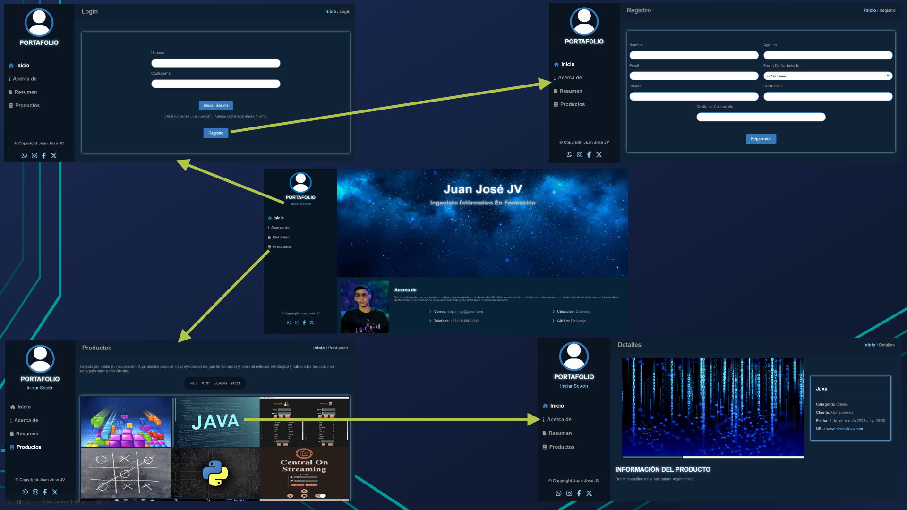

# VISTA PREVIA

**EJECUCIÓN:** `python3 manage.py runserver`

* Requiere la librería django: `pip install django`
* Requiere python en la versión 3.X instalado en el path: [Descargar](https://www.python.org/downloads/)
